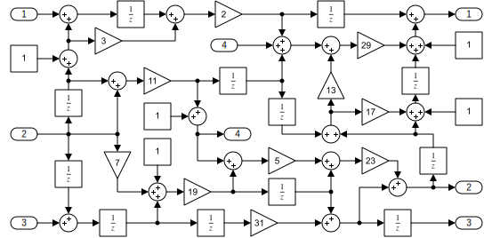

slQuery Manual
==============

These pages give a comprehensive description of all of `slQuery`'s features and best ways to 
use it.

* Refer to the [query language](query-language.md) reference page for exact descriptions of all
  language elements and features.

* Read about the [wrapper objects](wrapper-objects.md) and all the versatile interaction modes
  and other possibilities provided by them

* Read [model construction](model-construction.md) to learn about the experimental features
  that you can use to build up or restructure Simulink models.

Or stay on this page and look at some examples – in order of increasing fun!


#### a note about vector graphics (svg) here on github

The sometimes weird spacing of text in the illustrations is a result of on-the-fly svg 
compression done by github. You can click any of the illustrations to get a better rendering.

The Basic Idea
--------------

`slQuery` is a MATLAB script/helper-class which assists during the two main steps common in any 
scripted interaction with Simulink models: selection and manipulation Simulink model blocks.

1. `slQuery` has a sophisticated method for block search: You call the class constructor with 
   special strings that describe what blocks or groups of blocks shall be picked out from the 
   current model for further work.

2. With the resulting object, you can access block parameters and structural features using 
   MATLAB operator syntax.

For example given a simulink model like this



and passing the querystring ('Gain')

```matlab
>> gain_blocks = slQuery('Gain')
```
    
gives a result like this

<pre>
gain_blocks = 
slQuery with handles
   238.0010  239.0010  240.0010  241.0010  242.0010  243.0010  244.0010  245.0010  246.0010  247.0010  248.0010
</pre>

The result object is a matrix and contains handles of all blocks, that are of block type 'Gain' 
– one _column_ for each block. The separate matrix entries are even displayed as clickable 
_hyperlinks_, which highlight the block in the Simulink model view window.


From this result object one can retrieve and manipulate most data that is annotated to the 
blocks (called the _block parameters_). Instead of using the `get_param`/`set_param` or similar 
API-functions of Simulink, the result object behaves as if it allowed field-subscripts 
(`object.fieldname`) for each block parameter. Reading a field value then just delegates to 
Simulinks `get_param`.

```matlab
>> gain_blocks.Gain
ans =
  1×11 cell array
    {'2'}    {'2'}    {'2'}    {'2'}    {'2'}    {'2'}    {'2'}    {'2'}    {'2'}    {'2'}    {'2'}
```

Assigning to the parameter is shorthand form for a `set_param`-API call

```matlab
>> gain_blocks.BackgroundColor = 'green';
```


Unlike the builtin object-style API which you can access using `get(handle, 'Object')`, slQuery 
wrappers provide lots of convenience when it comes to vectorizing code, i.e. when performing 
operations on _arrays of blocks_ instead of one by one. Notice for example, how the command 
above has set the "BackgroundColor" property of all selected the blocks in one go (without 
using a loop).

You can use normal MATLAB matrix subscripts to access only some part of the blocks.

```matlab
>> gain_blocks(3).Position
ans  =
   360   205   390   235
>> gain_blocks(2:7).BackgroundColor = 'lightBlue';
>> gain_blocks.Gain = strsplit('2 3 5 7 11 13 17 19 23 29 31');
```


Idioms
------

### Unpacking

### Iteration

```matlab
>> for unit_delay = slQuery('UnitDelay')
    disp(unit_delay(2).hyperlink)
end
```
gives
```
[Unit Delay](Iteration)
[Unit Delay1](Iteration)
[Unit Delay10](Iteration)
[Unit Delay11](Iteration)
[Unit Delay2](Iteration)
[Unit Delay3](Iteration)
[Unit Delay4](Iteration)
[Unit Delay5](Iteration)
[Unit Delay6](Iteration)
[Unit Delay7](Iteration)
[Unit Delay8](Iteration)
[Unit Delay9](Iteration)
```
    
In the loop we just print the result of the special 'hyperlink' property that each slQuery
result object provides. Instead of the handle, the link will then show the block's name.

Sidenote: The operator overloading scheme is carefully chosen to "somewhat match" the syntax of 
the query language in the constructor. E.g. a dot-expression ("`X.member`") refers to block 
parameters in both the query language and in the matlab level, the colon-operator symbolizes 
selection of a port. You can literally retrieve a result object wrapping the signal port of a 
block with this syntax.

```
input_line_at_port_3 = 3:block_result
```

And notice that this is valid MATLAB syntax for "the range from 3 to whatever the numeric value 
of block_result is" - only the semantics are overwritten in slQuery objects. Signal output 
ports are retrieved by putting the port index at the right hand side.


Selecting single blocks like this wouldn't be super useful. But fear not, the query language
allows also to look for combinations of blocks in the model. You just specify multiple block
queries and also what relation to look for among them.

For example, to find pairs Summation blocks that are connected directly to Gain blocks, just do
the following.

```matlab
>> sum_to_gain = slQuery('Sum -> Gain');
>> sum_to_gain.hyperlinks
```
gives
```
ans =
  2×9 cell array
    {'Sum' }    {'Sum11'}    {'Sum11'}    {'Sum13'}    {'Sum14'}    {'Sum3' }    {'Sum4' }    {'Sum8' }    {'Sum9'  }
    {'Gain'}    {'Gain3'}    {'Gain4'}    {'Gain5'}    {'Gain1'}    {'Gain6'}    {'Gain2'}    {'Gain7'}    {'Gain10'}
```
Notice the usefulness of a table of hyperlinks like this.

Again each column of the result represents one occurrence of the situation described by the
query. So there are 7 pairs of Sum+Gain blocks in the model. Lets highlight them:

```matlab
sum_to_gain.BackgroundColor = {'magenta'; 'cyan'}
```

tanglemodel-pairs.png

Notice also how a Summation block 'Sum11' is shared by two of our findings (followed by Gain
blocks 'Gain4' and 'Gain3' respectively). In general, slQuery will yield each unique comination
of blocks that satisfy the query, once.

tricks

Another nice trick is, that the transpose operator can be used to "disperse" the query result
into multiple return values. This way, once can assign each row of the query result to another
variable.

```
[before, ~, after] = slQuery('Sum -> Gain -> Sum')'
before = 
slQuery with handles
   1.0e+03 *
    2.6380    2.6950    2.9020    2.6850    2.7100    2.6580
after = 
slQuery with handles
   1.0e+03 *
    2.7050    2.6580    2.6580    2.8850    2.9580    2.6850

before.BackgroundColor = 'green';
after.BackgroundColor = 'red';
```

The second return value is discarded using the '~'-syntax. This is useful, when only some of
the blocks in the query are required for further manipulation.
